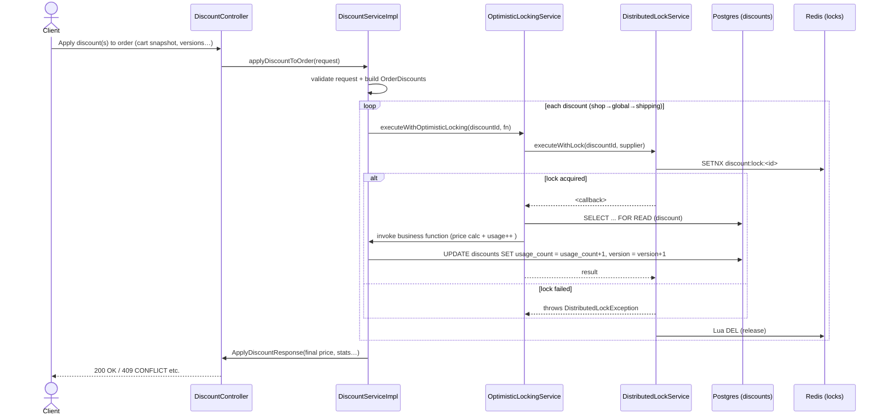

# Promotion Microservice

## 1. Project Overview

The **Promotion Service** is a core component of the e-commerce microservice architecture, responsible for managing all aspects of promotional campaigns, discount programs, flash sales, and customer incentive logic. It enables dynamic, rule-based promotions, supports complex discount stacking, and ensures high concurrency and data integrity in distributed environments.

**Key Features:**
- Campaign and promotion program management (discounts, cashback, bundles, etc.)
- Rule-based eligibility and action system
- Flash sale and time-limited event support
- Vendor participation and contribution tracking
- Customer usage and analytics
- Optimistic and distributed locking for safe concurrent updates
- RESTful API for integration with cart, order, and product services

---

## 2. Architecture & Design

The service is built with Spring Boot and leverages both **optimistic locking** (JPA versioning) and **distributed locking** (Redis) to ensure safe concurrent updates, especially for discount usage and flash sales. The design supports horizontal scaling and high availability.

**Concurrency Handling:**
- **Optimistic Locking:** Ensures that updates to discount usage counts are safe, even under high concurrency, by using a version field in the database.
- **Distributed Locking:** Uses Redis to prevent race conditions across multiple service instances in a distributed environment.
- **Double-layer Locking:** Both mechanisms are combined to guarantee correctness and performance.

**Distributed Systems Approach:**
- Service discovery via Eureka
- Asynchronous messaging with RabbitMQ
- Caching with Redis and Caffeine
- Integration with Elasticsearch for analytics

### Discount Application Flow



---

## 3. Technology Stack

- **Java 21**, **Spring Boot 3**
- **Spring Data JPA** (PostgreSQL/CockroachDB)
- **Spring Data Redis** (distributed locking, caching)
- **RabbitMQ** (event bus)
- **Elasticsearch** (analytics, search)
- **Caffeine** (local cache)
- **Lombok** (boilerplate reduction)
- **JUnit, Mockito** (testing)
- **Docker** (containerization)
- See [`pom.xml`](./pom.xml) for full dependency list.

---

## 4. Database Schema

The schema is designed for flexibility and analytics, with strong referential integrity and support for advanced promotion logic.

**Main Tables:**
- `campaigns`: Top-level marketing campaigns
- `promotion_programs`: Specific promotions (discounts, cashback, etc.)
- `promotion_rules`: Eligibility rules (min order, customer tier, etc.)
- `promotion_actions`: Actions (percentage discount, free shipping, etc.)
- `vendor_promotion_participations`: Vendor opt-in/mandate tracking
- `promotion_products`: Products included in promotions
- `customer_promotion_usage`: Tracks customer usage and limits
- `promotion_commissions`: Revenue and commission tracking
- `promotion_analytics`: Daily analytics and performance
- `flash_sales`: Flash sale event details
- `discounts`: Enhanced discount system (codes, stacking, etc.)

**Relationships:**
- Strong foreign key constraints between programs, vendors, customers, and usage
- See [`ecommerce_promotion_db.sql`](./ecommerce_promotion_db.sql) for full DDL and ERD.

---

## 5. Configuration

All configuration is managed via `application.yaml` and environment variables.

**Key Settings:**
- `server.port`: Service port (default: 8095)
- `spring.datasource.*`: Database connection (PostgreSQL/CockroachDB)
- `spring.data.redis.*`: Redis host/port for distributed locking and caching
- `spring.rabbitmq.*`: RabbitMQ for event bus
- `spring.elasticsearch.*`: Elasticsearch for analytics
- `jwt.*`: JWT secret and token validity
- Logging levels for debugging and tracing

See [`application.yaml`](./src/main/resources/application.yaml) for all options.

---

## 6. Optimistic Locking & Concurrency Control

The service uses a robust double-layer locking strategy for safe concurrent discount application:

- **Optimistic Locking:** Each discount entity has a `version` field. Updates check this version to prevent lost updates.
- **Distributed Locking:** A Redis-based lock (SETNX with TTL) ensures only one instance can update a discount at a time.
- **Workflow:** When applying a discount, the service:
  1. Acquires a Redis lock for the discount.
  2. Reads the discount with a JPA optimistic lock.
  3. Applies business logic and increments usage.
  4. Updates the discount, incrementing the version.
  5. Releases the Redis lock.

**Error Handling:**
- `OptimisticLockingException`: 409 Conflict if version mismatch
- `DistributedLockException`: 503/500 if unable to acquire lock
- See [`discount-optimistic-locking.md`](./discount-optimistic-locking.md) for full details and sequence diagrams.

---

## 7. API Documentation

### Main Endpoints (`DiscountController`)

| Method | Path | Description |
|--------|------|-------------|
| POST   | `/discounts` | Create a new discount |
| GET    | `/discounts/{id}` | Get discount by ID |
| PATCH  | `/discounts/status` | Update discount status |
| POST   | `/discounts/assign-products` | Assign products to discount |
| POST   | `/discounts/assign-categories` | Assign categories to discount |
| PATCH  | `/discounts/partial` | Partial update of discount |
| DELETE | `/discounts/{id}` | Delete a discount |
| POST   | `/discounts/claim` | Customer claims a discount |
| GET    | `/discounts/{id}/validity` | Check discount validity |
| GET    | `/discounts` | List/search discounts (paged) |
| POST   | `/discounts/apply-cart` | Apply discount to cart |
| POST   | `/discounts/apply-order` | Apply discount to order |

**Request/Response Models:** See `model/request` and `model/response` packages for full DTOs.

---

## 8. Setup & Installation

### Prerequisites

- Java 21+
- Maven 3.8+
- Docker (for PostgreSQL, Redis, RabbitMQ, Elasticsearch)
- (Optional) Eureka server for service discovery

### Steps

1. **Clone the repository:**
   ```bash
   git clone <repo-url>
   cd microservice/promotion
   ```

2. **Start dependencies (Docker Compose):**
   ```bash
   docker-compose up -d
   ```

3. **Configure environment:**
   - Edit `src/main/resources/application.yaml` as needed.

4. **Build and run:**
   ```bash
   mvn clean install
   mvn spring-boot:run
   ```

---

## 9. Usage Examples

### Apply Discount to Order (with Version Control)

```java
// Example: Applying a discount with optimistic locking
ApplyDiscountRequest request = new ApplyDiscountRequest();
request.setDiscountId(discountId);
request.setDiscountVersion(currentVersion); // from client/cart snapshot
// ... set other fields

ResponseEntity<ApplyDiscountResponse> response = discountController.applyDiscountToOrder(accountRequest, request);

if (response.getStatusCode() == HttpStatus.CONFLICT) {
    // Handle version conflict: fetch latest discount, retry
}
```

---

## 10. Testing

- **Unit Tests:** Cover business logic, validation, and error handling.
- **Integration Tests:** Simulate concurrent discount applications, verify usage limits, and locking.
- **Manual Concurrency Tests:** Use provided test runners to simulate high-load scenarios.
- **Test Coverage:** Includes optimistic locking, distributed locking, and rollback scenarios.

---

## 11. Deployment

- Build Docker image:
  ```bash
  mvn clean package
  docker build -t promotion-service .
  ```
- Deploy with Docker Compose or Kubernetes.
- Configure environment variables/secrets for production (DB, Redis, RabbitMQ, JWT).
- Monitor logs and metrics (Spring Boot Actuator, Micrometer).

---

## 12. Troubleshooting

**Common Issues:**
- **OptimisticLockingException:** Indicates concurrent update; client should retry with latest version.
- **DistributedLockException:** Service could not acquire Redis lock; check Redis availability and TTL settings.
- **Database Connection Errors:** Verify DB host/port and credentials.
- **RabbitMQ/Elasticsearch/Redis Unavailable:** Ensure all dependencies are running and accessible.

**Tips:**
- Enable debug logging for detailed traces.
- Use Actuator endpoints for health checks.
- Adjust lock timeouts and retry settings in `application.yaml` as needed.

---

For further details, see the referenced files:
- [`pom.xml`](./pom.xml)
- [`discount-optimistic-locking.md`](./discount-optimistic-locking.md)
- [`ecommerce_promotion_db.sql`](./ecommerce_promotion_db.sql)
- [`application.yaml`](./src/main/resources/application.yaml)
