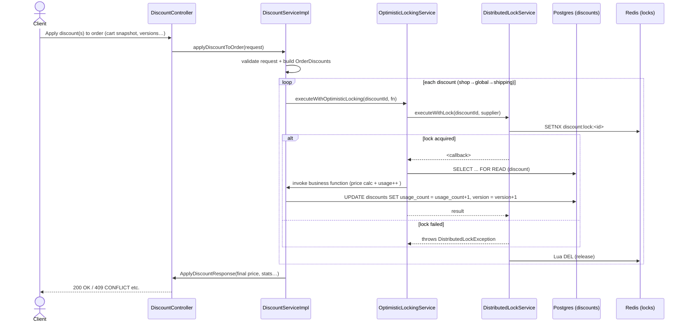

# Discount Application – Optimistic-Locking & Distributed-Lock Design

This document describes the runtime flow used by **Promotion-Service** when a client calls the
`POST /discounts/apply-order` (business name) endpoint that maps to
`DiscountService.applyDiscountToOrder(..)`.

## 1. High–level sequence

## 2. Main classes & responsibilities

| Class | Responsibility |
|-------|----------------|
| `DiscountServiceImpl` | Orchestrates the discount application: validation, cart math, sequencing (shop→global→shipping), creates usage records. |
| `OptimisticLockingService` | Wraps a **JPA optimistic lock** (+ retry) *and* a **distributed lock** so that multi-instance race conditions are handled. |
| `DistributedLockService` | Thin Redis-based lock (SETNX with TTL, Lua-verified release). Prevents cross-node concurrent modification. |
| `EDiscount` | Entity with `@Version long version` to let Hibernate detect concurrent updates. |

## 3. Important invariants

1. **Version Check** – Client can pass `discountVersion`, `shopDiscountVersion`, … in the request.
   `DiscountServiceImpl.validateDiscountVersions()` compares these with current DB versions early and fails fast.
2. **Double-layer locking**
   * **Redis lock** guarantees only one JVM writes the same discount concurrently.
   * **JPA optimistic lock** (version column) guarantees consistency if two threads on the **same** node skipped Redis (edge cases).
3. **Usage-limit enforcement** happens *inside* the optimistic-locking callback, guaranteeing the `usage_count` checked is the same that gets updated.
4. **Cart Propagation Bug Fixed** – `applyDiscountsInOrderWithLocking` now chains carts correctly (`cartAfterShopDiscount` → `cartAfterGlobalDiscount`).

## 4. Error handling

| Exception | HTTP outcome (example) | When |
|-----------|-----------------------|------|
| `OptimisticLockingException` | 409 Conflict | Version mismatch after retries
| `DistributedLockException` | 503/500 | Unable to get Redis lock within `waitTimeout`
| `ResourceNotFoundException` | 404 / 400 | Invalid discount, not applicable shop, etc.

## 5. Configuration notes

* **Redis** configured via `spring.data.redis.*` in `application.yaml` with Lettuce pool (max-active 8 …).
* `RedisTemplate<String,String>` is wired with `StringRedisSerializer` so keys/values remain readable.
* Timeouts: lock TTL 30 s, acquisition wait 5 s (see `DistributedLockService` constants). Adjust in future via constructor args or externalised config.

## 6. Test coverage

* **Unit** – `OptimisticLockingServiceTest` exercises retry logic, version validation.
* **Integration** – `OptimisticLockingIntegrationTest` spins up Spring context, mocks Redis, runs 10 concurrent threads, ensures only usageLimitTotal successes.
* **Manual Concurrency** – `ConcurrencyTestRunner` (plain `main`) useful during dev profiling.

---

### Future improvements

1. Expose metrics (Micrometer) for lock wait-time / conflicts.
2. Parametrize lock timeouts via `@ConfigurationProperties`.
3. Batch apply discounts inside single DB TX for atomicity across multiple discounts (currently sequential). 
